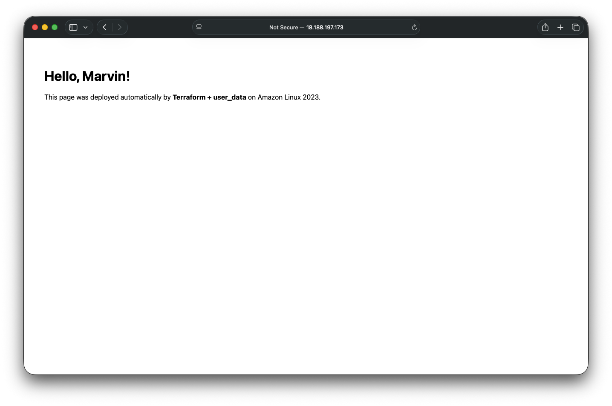

# Marvin Terraform Exercise

A minimal AWS deployment using Terraform that provisions a VPC, subnet, and EC2 instance hosting a simple “Hello, Marvin!” web page.

---

## Overview

This project demonstrates how to use Terraform to deploy infrastructure on AWS following secure, auditable, and automation-friendly practices.

It creates:
- A VPC with one public subnet
- An Internet Gateway and route table for outbound connectivity
- A Security Group that allows only HTTP (port 80)
- A t3.micro EC2 instance (free-tier eligible) running Amazon Linux 2023
- An NGINX web server installed automatically via user_data
- SSH disabled by default - access via AWS Systems Manager (SSM) if needed

---

## Infrastructure Diagram (Conceptual)

```
Terraform (your code) ──────────────────────────────► AWS Cloud (what gets created)

main.tf            →  VPC  
variables.tf       →  Subnet (public)  
outputs.tf         →  Internet Gateway  
user_data.sh       →  Route Table + EC2 (nginx)  
                    →  Security Group (HTTP 80)
```

---

## Deployment Steps

1. Configure your AWS CLI  
   Make sure your IAM user (`terraform-admin`) is set up and authenticated:  
   ```bash
   aws configure
   ```

2. Initialize Terraform  
   ```bash
   terraform init
   ```

3. Preview what Terraform will create  
   ```bash
   terraform plan -out plan.out
   ```

4. Deploy the infrastructure  
   ```bash
   terraform apply -auto-approve
   ```

5. Get your public site URL  
   ```bash
   terraform output -raw hello_world_url
   ```

6. Open the site in your browser or run:  
   ```bash
   curl $(terraform output -raw hello_world_url)
   ```
   You should see:
   ```
   Hello, Marvin!
   ```

---

## Troubleshooting Notes

| Issue | Fix |
|-------|-----|
| Free-tier error for t2.micro | Switched to `t3.micro` |
| Capacity error in a zone | Changed AZ to `us-east-2a` |
| Page not loading | Waited 30–60s for NGINX install |
| Want to allow SSH | Use `terraform apply -var="allowed_ssh_cidr=YOUR.IP.ADDR/32"` |

---

## Security and HIPAA Considerations

This deployment intentionally limits public exposure and follows least-privilege design.  
Future enhancements for HIPAA-grade environments would include:

- Private subnets and an Application Load Balancer (ALB)
- End-to-end TLS with ACM-managed certificates
- KMS encryption for EBS, S3, and backups
- CloudTrail and VPC Flow Logs for audit tracking
- IAM role separation and MFA enforcement
- Automated compliance checks (for example: tfsec, Checkov)

---

## Teardown

Destroy resources when finished to avoid charges:
```bash
terraform destroy -auto-approve
```

---

## Proof of Deployment

Screenshot of the deployed website:



---

## Author

George Lozano  
IT Systems Engineer | Infrastructure Automation | Security and Identity
